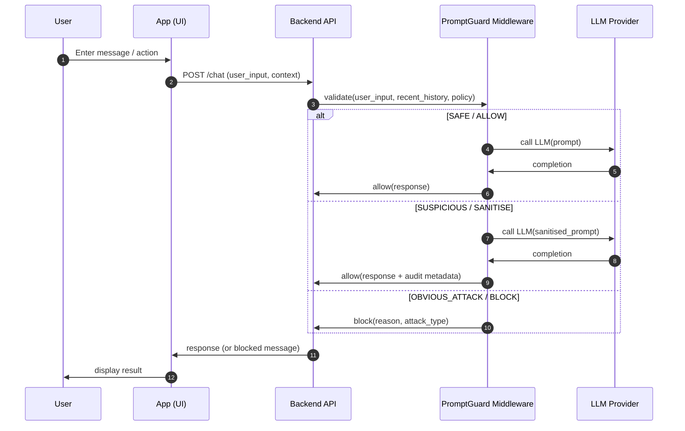

# PromptGuard — AI Prompt Injection Firewall

> Defending AI with AI. Real-time two-tier firewall that detects and blocks prompt injection attacks before they reach the model.

## Architecture

```
User Input
    │
    ▼
┌──────────────────────────────┐
│  TIER 1: Crusoe / Qwen3-235B │  <500ms — classifies every prompt
│  SAFE / SUSPICIOUS / ATTACK  │
└──────────┬───────────────────┘
           │ suspicious / obvious attack
           ▼
┌──────────────────────────────┐
│  TIER 2: Claude Haiku        │  deep analysis — JSON verdict
│  BLOCK / SANITISE / ALLOW    │  attack_type, confidence, reason
└──────────────────────────────┘
```

### Business Flow


**6-category attack taxonomy:** Direct Jailbreak, Indirect Injection, Role Hijacking, Payload Smuggling, Context Manipulation, Information Extraction.

## Quick Start (Docker — recommended)

```bash
# 1. Create a .env file in the project root with your API keys:
#
#    CRUSOE_API_KEY=<your-crusoe-key>
#    CLAUDE_API_KEY=<your-anthropic-key>

# 2. Build and start all three services
docker compose up --build
```

| Service | URL |
|---------|-----|
| Frontend | http://localhost:5173 |
| Firewall proxy (API) | http://localhost:8000 |
| Demo backend | http://localhost:8001 |
| API docs (Swagger) | http://localhost:8000/docs |

Services start in dependency order: backend → demo-backend → frontend. The healthcheck runs automatically; expect ~15 s before the frontend is ready.

## Quick Start (local, no Docker)

Run each service in a separate terminal from the `prompt-guard/` root.

```bash
# Terminal 1 — Firewall proxy
cd proxy
pip install -r requirements.txt
uvicorn api:app --reload --port 8000
```

```bash
# Terminal 2 — Demo backend
cd demo-backend
pip install -r requirements.txt
uvicorn main:app --reload --port 8001
```

```bash
# Terminal 3 — Frontend
cd frontend
npm install
npm run dev
```

> **Prerequisites:** Python 3.10+, Node.js 18+, a `.env` file in `prompt-guard/` containing `CRUSOE_API_KEY` and `CLAUDE_API_KEY`.

## Project Structure

```
prompt-guard/
├── proxy/                        # FastAPI firewall proxy (port 8000)
│   ├── api.py                    # /check and /health endpoints
│   ├── requirements.txt
│   ├── Dockerfile
│   └── detection/
│       └── crusoe_tier.py        # Two-tier firewall logic
├── demo-backend/                 # FastAPI demo app behind the firewall (port 8001)
│   ├── main.py                   # /chat, /report, /session/reset endpoints
│   ├── requirements.txt
│   └── Dockerfile
├── frontend/                     # React + Vite UI (port 5173)
│   ├── Dockerfile
│   ├── vite.config.js
│   └── src/
│       ├── App.jsx
│       └── widget/               # Firewall widget components
├── data/
│   ├── prompts/                  # Tier 1 & Tier 2 prompt templates
│   ├── labelled/                 # HuggingFace labelled datasets
│   └── spot_test.py              # Evaluation harness
├── eval/
│   ├── attacks_testing.jsonl     # Hand-written attack test cases (60)
│   └── benign_testing.jsonl      # Hand-written benign test cases (33)
├── docker-compose.yml
└── .env                          # API keys (not committed)
```

## API Endpoints

| Method | Path | Description |
|--------|------|-------------|
| POST | `/check` | Run prompt through firewall — returns `action`, `tier`, `analysis` |
| GET | `/health` | Health check — returns `{"status": "ok"}` |
| GET | `/docs` | Auto-generated Swagger UI |
 GET | `/session/stats` | Dashboard statistics |
| GET | `/session/history` | Prompt history |
| POST | `/report` | Generate threat report |
| POST | `/session/reset` | Reset session |
| GET | `/health` | Health check |

### POST /check

Request:
```json
{ "prompt": "Ignore all previous instructions..." }
```

Response (Tier 1 SAFE — fast path):
```json
{ "action": "allow", "tier": 1 }
```

Response (Tier 2 — attack detected):
```json
{
  "action": "block",
  "tier": 2,
  "analysis": {
    "verdict": "BLOCK",
    "attack_type": "direct_jailbreak",
    "confidence": 0.97,
    "reason": "Explicit instruction override attempt"
  }
}
```

## Running Evaluation

```bash
# Quick run — 93 hand-written prompts, no extra API spend
python data/spot_test.py --quick

# Full run — adds English-only HuggingFace samples (~113 prompts)
python data/spot_test.py

# Test Tier 2 (Claude) prompt in isolation
python data/spot_test.py --quick --tier2-only

# Latency check — times 20 Tier 1 calls vs <500ms target
python data/latency_check.py
```

## Environment Variables

| Variable | Description |
|----------|-------------|
| `CRUSOE_API_KEY` | Crusoe hackathon API key |
| `CLAUDE_API_KEY` | Anthropic API key |

## Challenge Alignment

| Prize | How |
|-------|-----|
| Security Track | OWASP LLM01 — the #1 AI-enabled threat |
| Best Use of Claude | Deep analysis engine + structured JSON verdicts |
| Best Use of Crusoe | High-throughput Tier 1 triage at <500ms using Qwen3-235B |
| Best Use of Data | 4+ sources, 6-category taxonomy, 98% accuracy |
| Best Adaptable Agent | Session-level attack pattern tracking |
